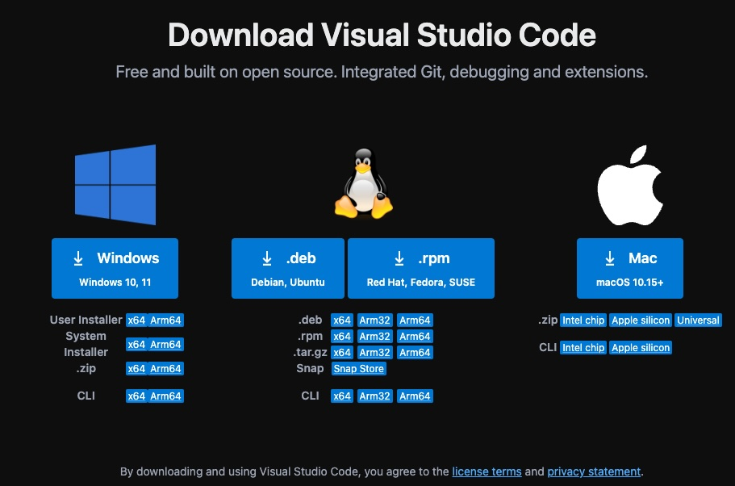
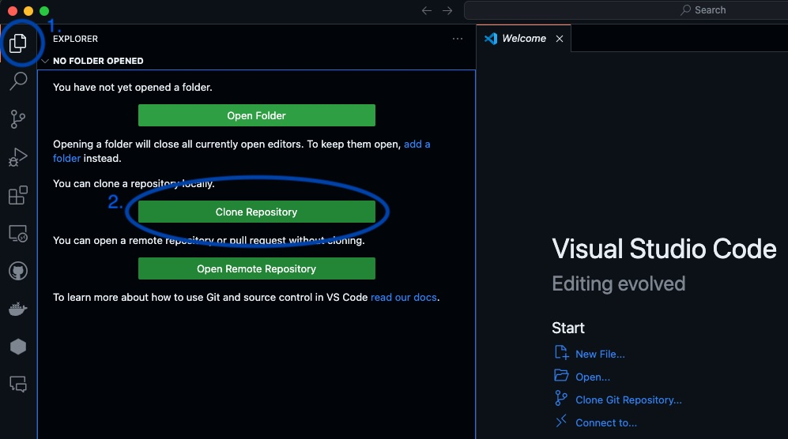
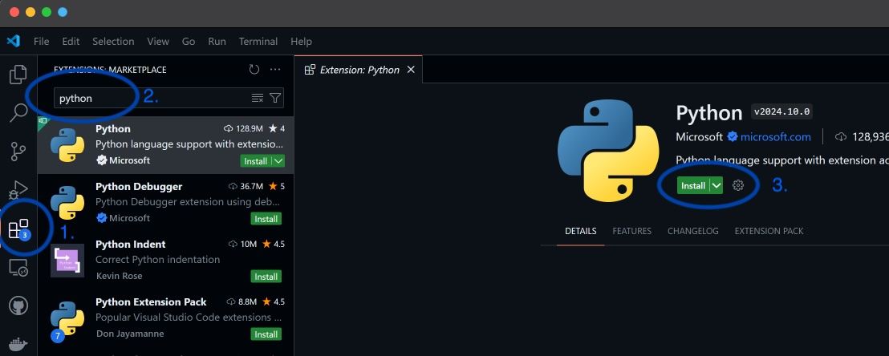
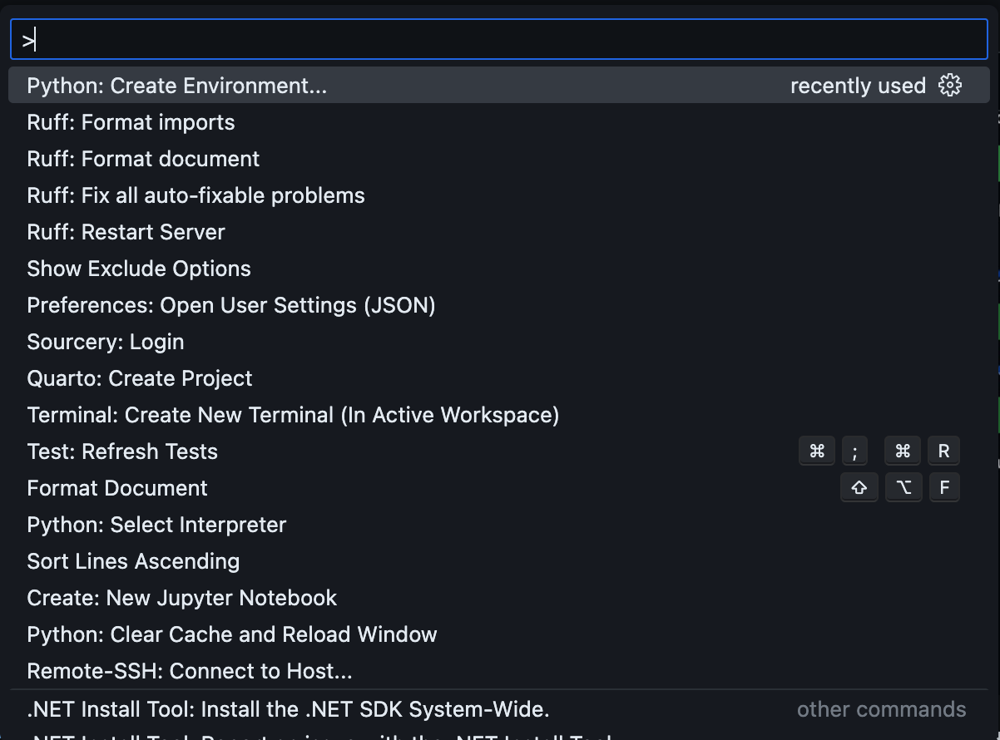
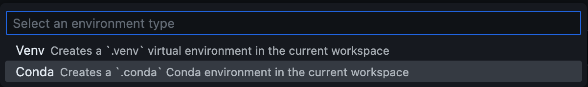
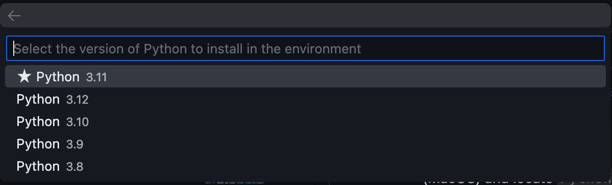

# CIDS_Carpentries_Python
Curtin Institute for Data Science adaptation of the [Software Carpentries](https://swcarpentry.github.io/python-novice-inflammation/) and [Data Carpentries](https://datacarpentry.org/python-ecology-lesson/) Python lessons.

The best way to learn how to program is to do something useful, so this introduction to Python is built around a common scientific task: data analysis. 

## Schedule
1. [Introduction to the Workshop and Tools](https://tinyurl.com/202409-cids-python)
2. [Python Fundamentals](https://swcarpentry.github.io/python-novice-inflammation/01-intro.html)
3. [Analysing Patient Data](https://swcarpentry.github.io/python-novice-inflammation/02-numpy.html)
4. [Visualising Tabular Data](https://swcarpentry.github.io/python-novice-inflammation/03-matplotlib.html)
5. [Storing Multiple Values in Lists](https://swcarpentry.github.io/python-novice-inflammation/04-lists.html)
6. [Repeating Actions with Loops](https://swcarpentry.github.io/python-novice-inflammation/05-loop.html)
7. [Analysing Data from Multiple Files](https://swcarpentry.github.io/python-novice-inflammation/06-files.html) 
8. [Making Choices](https://swcarpentry.github.io/python-novice-inflammation/07-cond.html) 
9. [Creating Functions](https://swcarpentry.github.io/python-novice-inflammation/08-func.html)
10. [Data Analysis with Pandas](https://datacarpentry.org/python-ecology-lesson/02-starting-with-data.html)


## Before You Start
Prior to attending this workshop, please follow the below instructions to setup your personal laptop. **Ensure that you have administrator permissions if you are using a corporate laptop.**

### Local Setup
1. Navigate to the https://code.visualstudio.com/ with your web browser.
2. Download Visual Studio Code for your specific platform/Operating System.

    
3. Run the Visual Studio Code Installer and follow all prompts.
4. Open Visual Studio Code, navigate to the File Explorer and clone this repository with the following repository name `https://github.com/CurtinIDS/CIDS_Carpentries_Python` into your preferred folder destination.

    
5. Navigate to the Extension sidebar then search for and install the Python and Jupyter extensions.

    
6. Enter the Visual Studio Code Command Pallette using `Ctrl + Shift + P` (Windows) or `Command + Shift + P` (MacOS) and locate `Python: Create Environment`.

    
7. Select `Conda`.

    
8. Select `Python 3.11`.

    
9. Open Command Prompt or Terminal within Visual Studio Code using `Ctrl + J` (Windows) or `Command + J` (MacOS).
10. Activate the created environment using the following command.

    `conda activate ./.conda/`
11. Run the following command to install dependencies.

    `pip install -r requirements.txt`

### Google Colab
If you were unable to complete the above steps, you may alternatively access the workshop material using Google Colaboratory. Please ensure that you have a Google Account.
1. [Episode 1 - Python Fundamentals](https://colab.research.google.com/github/CurtinIDS/CIDS_Carpentries_Python/blob/main/notebooks_colab/1_Python_Fundamentals_colab.ipynb)
2. [Episode 2 - Analysing Patient Data](https://colab.research.google.com/github/CurtinIDS/CIDS_Carpentries_Python/blob/main/notebooks_colab/2_Analysing_Patient_Data_colab.ipynb)
3. [Episode 3 - Visualising Tabular Data](https://colab.research.google.com/github/CurtinIDS/CIDS_Carpentries_Python/blob/main/notebooks_colab/3_Visualising_Tabular_Data_colab.ipynb)
4. [Episode 4 - Storing Multiple Values in Lists](https://colab.research.google.com/github/CurtinIDS/CIDS_Carpentries_Python/blob/main/notebooks_colab/4_Storing_Multiple_Values_in_Lists_colab.ipynb)
5. [Episode 5 - Repeating Actions with Loops](https://colab.research.google.com/github/CurtinIDS/CIDS_Carpentries_Python/blob/main/notebooks_colab/5_Repeating_Actions_with_Loops_colab.ipynb)
6. [Episode 6 - Analysing Data from Multiple Files](https://colab.research.google.com/github/CurtinIDS/CIDS_Carpentries_Python/blob/main/notebooks_colab/6_Analysing_Data_from_Multiple_Files_colab.ipynb)
7. [Episode 7 - Making Choices](https://colab.research.google.com/github/CurtinIDS/CIDS_Carpentries_Python/blob/main/notebooks_colab/7_Making_Choices_colab.ipynb)
8. [Epsiode 8 - Creating Functions](https://colab.research.google.com/github/CurtinIDS/CIDS_Carpentries_Python/blob/main/notebooks_colab/8_Creating_Functions_colab.ipynb)
9. [Episode 9 - Data Analysis with Pandas](https://colab.research.google.com/github/CurtinIDS/CIDS_Carpentries_Python/blob/main/notebooks_colab/9_Data_Analysis_with_Pandas_colab.ipynb)


# Contributing (Instructors only)
If you wish to contribute, it's recommended to add the included pre-commit to your hooks.   
Once you've cloned, in a Terminal window opened within the main repo directory, run the following:
```
cp build_scripts/pre-commit .git/hooks/pre-commit
chmod +x .git/hooks/pre-commit
```
This will do the following every time you commit:
- Any updated notebooks will have a colab version made and placed in `notebooks_colab` and include these in your commit
- Clear the cells of all notebooks before uploading
